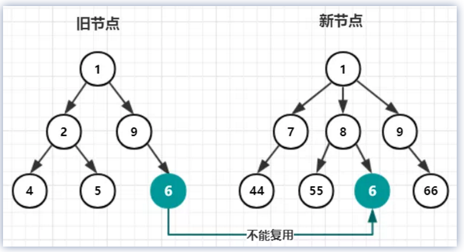

# 虚拟DOM

## 一、什么是虚拟DOM？

> 我们在操作DOM时，往往代价太大，若在一次操作中，我们需要更新10个DOM节点，浏览器收到一个DOM请求后并不知道还有9次更新操作，因此会马上执行流程，最终执行10次。

#### 1.1 虚拟DOM的好处

虚拟DOM就是为了解决浏览器性能问题而被设计出来的。有了虚拟DOM后，若一次操作中有10次更新DOM的动作，虚拟DOM不会立即操作DOM，而是将这10次更新的`diff`内容保存到本地一个`JS`对象中，最终将这个`JS`对象一次性`attch`到DOM树上，再进行后续操作，避免大量无谓的计算量。所以，用 `JS` 对象模拟 `DOM` 节点的好处是，页面的更新可以先全部反映在 `JS` 对象(虚拟 `DOM` )上，操作内存中的 `JS` 对象的速度显然要更快，等更新完成后，再将最终的 `JS` 对象映射成真实的 `DOM`，交由浏览器去绘制。

而虚拟DOM其实也就是JS对象。

#### 1.2 `htmlToJSON`

```javascript
const createVNode = (tag) =>{
    return{
        tag,
        children:[]
    }
}
const createText = (text) =>{
    text = text.wholeText.trim();
    return {
        tag:'TEXT',
        text
    }
}
const htmlToJSON = (root) =>{
    const vnode = createVNode(root.tagName);
    root.childNodes && [...root.childNodes].forEach((child)=>{
        switch(child.nodeType){
            case 1:vnode.children.push(htmlToJSON(child));break;
            case 3:child.wholeText.trim() && vnode.children.push(createText(child));break;
        }
    })
    return vnode;
}
```


#### 1.3 `jsonToHTML`

```
const jsonToHTML = (root)=>{
    let node;
    const createText = ()=>{
        node = document.createTextNode(root.text);
    }
    const createEl = ()=>{
        node = document.createElement(root.tag);
        root.children && root.children.forEach((child)=>{
            node.appendChild(jsonToHTML(child));
        })
    }
    root.tag === "TEXT"?createText():createEl();
    return node;
}
```

## 二、diff算法分析

#### 2.1 diff的做法

`Vue` 只会对新旧节点中 父节点是相同节点 的 那一层子节点 进行比较

也可以说成是只有两个新旧节点是**相同节点**的时候，才会去比较他们各自的**子节点**。

这也叫做 同层级比较，并不需要递归，虽然好像降低了一些复用性，也是为了避免过度优化，是一种很高效的 `Diff` 算法。

#### 2.2 diff比较逻辑

Diff 比较的内核是  节点复用，所以 Diff 比较就是为了在 新旧节点中 找到 **相同的节点** 

这个的比较逻辑是建立在上一步说过的同层比较基础之上的。例如，下图所示



即使在同一层，但是他们的父节点不一样，也不会复用。

## 三、Vue源码分析

`diff`的过程就是调用patch函数，就像打补丁一样修改真实DOM。

```javascript
function patch (oldVnode, vnode) {
	if (sameVnode(oldVnode, vnode)) {
		patchVnode(oldVnode, vnode)
	} else {
		const oEl = oldVnode.el
		let parentEle = api.parentNode(oEl)
		createEle(vnode)
		if (parentEle !== null) {
			api.insertBefore(parentEle, vnode.el, api.nextSibling(oEl))
			api.removeChild(parentEle, oldVnode.el)
			oldVnode = null
		}
	}
	return vnode
}
```

`patch`有两个参数，一个是旧的`vnode`，一个是新的`vnode`。

首先是第一部分：

```javascript
if (sameVnode(oldVnode, vnode)) {
	patchVnode(oldVnode, vnode)
} 
```

`sameVnode`函数就是看这两个节点是否值得比较，代码相当简单：

```javascript
function sameVnode(oldVnode, vnode){
	return vnode.key === oldVnode.key && vnode.sel === oldVnode.sel
}
```

当节点不值得比较时，进入else中：

```javascript
else {
		const oEl = oldVnode.el
		let parentEle = api.parentNode(oEl)
		createEle(vnode)
		if (parentEle !== null) {
			api.insertBefore(parentEle, vnode.el, api.nextSibling(oEl))
			api.removeChild(parentEle, oldVnode.el)
			oldVnode = null
		}
	}
```

过程如下：

- 取得`oldvnode.el`的父节点，`parentEle`是真实dom
- `createEle(vnode)`会为`vnode`创建它的真实dom，令`vnode.el` =`真实dom`
- `parentEle`将新的dom插入，移除旧的dom
  **当不值得比较时，新节点直接把老节点整个替换了**

#### `patchVnode`

当两个节点值得比较的时候，会调用`patchVnode`函数
```javascript
patchVnode (oldVnode, vnode) {
    //让vode.el引用现在真实的dom，当el修改时，vnode.el也会修改
    const el = vnode.el = oldVnode.el
    let i, oldCh = oldVnode.children, ch = vnode.children
    if (oldVnode === vnode) return
    if (oldVnode.text !== null && vnode.text !== null && oldVnode.text !== vnode.text) {
        api.setTextContent(el, vnode.text)
    }else {
        updateEle(el, vnode, oldVnode)
    	if (oldCh && ch && oldCh !== ch) {
	    	updateChildren(el, oldCh, ch)
	    }else if (ch){
	    	createEle(vnode) //create el's children dom
	    }else if (oldCh){
	    	api.removeChildren(el)
	    }
    }
}
```

节点的比较有5种情况

1. `if (oldVnode === vnode)`，他们的引用一致，可以认为没有变化。
2. `if(oldVnode.text !== null && vnode.text !== null && oldVnode.text !== vnode.text)`，文本节点的比较，需要修改，则会调用`Node.textContent = vnode.text`。
3. `if( oldCh && ch && oldCh !== ch )`, 两个节点都有子节点，而且它们不一样，这样我们会调用`updateChildren`函数比较子节点，这是diff的核心，后边会讲到。
4. `else if (ch)`，只有新的节点有子节点，调用`createEle(vnode)`，`vnode.el`已经引用了老的dom节点，`createEle`函数会在老dom节点上添加子节点。
5. `else if (oldCh)`，新节点没有子节点，老节点有子节点，直接删除老节点。

#### updateChildren

```javascript
updateChildren (parentElm, oldCh, newCh) {
    let oldStartIdx = 0, newStartIdx = 0
    let oldEndIdx = oldCh.length - 1
    let oldStartVnode = oldCh[0]
    let oldEndVnode = oldCh[oldEndIdx]
    let newEndIdx = newCh.length - 1
    let newStartVnode = newCh[0]
    let newEndVnode = newCh[newEndIdx]
    let oldKeyToIdx
    let idxInOld
    let elmToMove
    let before
    while (oldStartIdx <= oldEndIdx && newStartIdx <= newEndIdx) {
            if (oldStartVnode == null) {   //对于vnode.key的比较，会把oldVnode = null
                oldStartVnode = oldCh[++oldStartIdx] 
            }else if (oldEndVnode == null) {
                oldEndVnode = oldCh[--oldEndIdx]
            }else if (newStartVnode == null) {
                newStartVnode = newCh[++newStartIdx]
            }else if (newEndVnode == null) {
                newEndVnode = newCh[--newEndIdx]
            }else if (sameVnode(oldStartVnode, newStartVnode)) {
                patchVnode(oldStartVnode, newStartVnode)
                oldStartVnode = oldCh[++oldStartIdx]
                newStartVnode = newCh[++newStartIdx]
            }else if (sameVnode(oldEndVnode, newEndVnode)) {
                patchVnode(oldEndVnode, newEndVnode)
                oldEndVnode = oldCh[--oldEndIdx]
                newEndVnode = newCh[--newEndIdx]
            }else if (sameVnode(oldStartVnode, newEndVnode)) {
                patchVnode(oldStartVnode, newEndVnode)
                api.insertBefore(parentElm, oldStartVnode.el, api.nextSibling(oldEndVnode.el))
                oldStartVnode = oldCh[++oldStartIdx]
                newEndVnode = newCh[--newEndIdx]
            }else if (sameVnode(oldEndVnode, newStartVnode)) {
                patchVnode(oldEndVnode, newStartVnode)
                api.insertBefore(parentElm, oldEndVnode.el, oldStartVnode.el)
                oldEndVnode = oldCh[--oldEndIdx]
                newStartVnode = newCh[++newStartIdx]
            }else {
               // 使用key时的比较
                if (oldKeyToIdx === undefined) {
                    oldKeyToIdx = createKeyToOldIdx(oldCh, oldStartIdx, oldEndIdx) // 有key生成index表
                }
                idxInOld = oldKeyToIdx[newStartVnode.key]
                if (!idxInOld) {
                    api.insertBefore(parentElm, createEle(newStartVnode).el, oldStartVnode.el)
                    newStartVnode = newCh[++newStartIdx]
                }
                else {
                    elmToMove = oldCh[idxInOld]
                    if (elmToMove.sel !== newStartVnode.sel) {
                        api.insertBefore(parentElm, createEle(newStartVnode).el, oldStartVnode.el)
                    }else {
                        patchVnode(elmToMove, newStartVnode)
                        oldCh[idxInOld] = null
                        api.insertBefore(parentElm, elmToMove.el, oldStartVnode.el)
                    }
                    newStartVnode = newCh[++newStartIdx]
                }
            }
        }
        if (oldStartIdx > oldEndIdx) {
            before = newCh[newEndIdx + 1] == null ? null : newCh[newEndIdx + 1].el
            addVnodes(parentElm, before, newCh, newStartIdx, newEndIdx)
        }else if (newStartIdx > newEndIdx) {
            removeVnodes(parentElm, oldCh, oldStartIdx, oldEndIdx)
        }
}
```


大概过程是：`oldCh`和`newCh`各有两个头尾变量`startIdx`和`EndIdx`，它们的2个变量相互比较，一共有4种比较放松。如果4种比较都没匹配，如果设置了key，就会用key进行比较，在比较的过程中，变量会往中间靠，一旦`StartIdx>EndIdx`表明`oldCh`和`newCh`至少就一个遍历完了，就会结束比较。

#### 具体diff分析

粉红色的部分为oldCh和vCh


我们将它们取出来并分别用s和e指针指向它们的头child和尾child


现在分别对`oldS、oldE、S、E`两两做`sameVnode`比较，有四种比较方式，当其中两个能匹配上那么真实dom中的相应节点会移到Vnode相应的位置，这句话有点绕，打个比方

- 如果是oldS和E匹配上了，那么真实dom中的第一个节点会移到最后
- 如果是oldE和S匹配上了，那么真实dom中的最后一个节点会移到最前，匹配上的两个指针向中间移动
- 如果四种匹配没有一对是成功的，分为两种情况
  - 如果新旧子节点都存在key，那么会根据`oldChild`的key生成一张hash表，用`S`的key与hash表做匹配，匹配成功就判断`S`和匹配节点是否为`sameNode`，如果是，就在真实dom中将成功的节点移到最前面，否则，将`S`生成对应的节点插入到dom中对应的`oldS`位置，`S`指针向中间移动，被匹配old中的节点置为null。
  - 如果没有key,则直接将`S`生成新的节点插入`真实DOM`（ps：这下可以解释为什么v-for的时候需要设置key了，如果没有key那么就只会做四种匹配，就算指针中间有可复用的节点都不能被复用了）

再配个图（假设下图中的所有节点都是有key的，且key为自身的值）


- 第一步

```
oldS = a, oldE = d；
S = a, E = b;
```

`oldS`和`S`匹配，则将dom中的a节点放到第一个，已经是第一个了就不管了，此时dom的位置为：a  b  d

- 第二步

```
oldS = b, oldE = d；
S = c, E = b;
```

`oldS`和`E`匹配，就将原本的b节点移动到最后，因为`E`是最后一个节点，他们位置要一致，这就是上面说的：**当其中两个能匹配上那么真实dom中的相应节点会移到Vnode相应的位置**，此时dom的位置为：a  d  b

- 第三步

```
oldS = d, oldE = d；
S = c, E = d;
```

`oldE`和`E`匹配，位置不变此时dom的位置为：a  d  b

- 第四步

```
oldS++;
oldE--;
oldS > oldE;
```

遍历结束，说明`oldCh`先遍历完。就将剩余的`vCh`节点根据自己的的index插入到真实dom中去，此时dom位置为：a  c  d  b

一次模拟完成。

这个匹配过程的结束有两个条件：

- `oldS > oldE`表示`oldCh`先遍历完，那么就将多余的`vCh`根据index添加到dom中去（如上图）

- ```
  S > E
  ```

  表示vCh先遍历完，那么就在真实dom中将区间为

  ```
  [oldS, oldE]
  ```

  的多余节点删掉

  


## 四、为什么不要以index作为key？

#### 节点reverse场景

假设我们有这样的一段代码：

```
    <div id="app">
      <ul>
        <item
          :key="index"
          v-for="(num, index) in nums"
          :num="num"
          :class="`item${num}`"
        ></item>
      </ul>
      <button @click="change">改变</button>
    </div>
    <script src="./vue.js"></script>
    <script>
      var vm = new Vue({
        name: "parent",
        el: "#app",
        data: {
          nums: [1, 2, 3]
        },
        methods: {
          change() {
            this.nums.reverse();
          }
        },
        components: {
          item: {
            props: ["num"],
            template: `
                    <div>
                       {{num}}
                    </div>
                `,
            name: "child"
          }
        }
      });
    </script>
```

其实是一个很简单的列表组件，渲染出来 `1 2 3` 三个数字。我们先以 `index` 作为key，来跟踪一下它的更新。

我们接下来只关注 `item` 列表节点的更新，在首次渲染的时候，我们的虚拟节点列表 `oldChildren` 粗略表示是这样的：

```
[
  {
    tag: "item",
    key: 0,
    props: {
      num: 1
    }
  },
  {
    tag: "item",
    key: 1,
    props: {
      num: 2
    }
  },
  {
    tag: "item",
    key: 2,
    props: {
      num: 3
    }
  }
];
```

在我们点击按钮的时候，会对数组做 `reverse` 的操作。那么我们此时生成的 `newChildren` 列表是这样的：

```
[
  {
    tag: "item",
    key: 0,
    props: {
+     num: 3
    }
  },
  {
    tag: "item",
    key: 1,
    props: {
+     num: 2
    }
  },
  {
    tag: "item",
    key: 2,
    props: {
+     num: 1
    }
  }
];
```

发现什么问题没有？key的顺序没变，传入的值完全变了。这会导致一个什么问题？

本来按照最合理的逻辑来说，`旧的第一个vnode` 是应该直接完全复用 `新的第三个vnode`的，因为它们本来就应该是同一个vnode，自然所有的属性都是相同的。

但是在进行子节点的 `diff` 过程中，会在 `旧首节点和新首节点用`sameNode`对比。` 这一步命中逻辑，因为现在`新旧两次首部节点` 的 `key` 都是 `0`了，

然后把旧的节点中的第一个 `vnode` 和 新的节点中的第一个 `vnode` 进行 `patchVnode` 操作。

这会发生什么呢？我可以大致给你列一下： 首先，正如我之前的文章[props的更新如何触发重渲染？](https://juejin.im/post/6844904113432444942#heading-8)里所说，在进行 `patchVnode` 的时候，会去检查 `props` 有没有变更，如果有的话，会通过 `_props.num = 3` 这样的逻辑去更新这个响应式的值，触发 `dep.notify`，触发子组件视图的重新渲染等一套很重的逻辑。

然后，还会额外的触发以下几个钩子，假设我们的组件上定义了一些dom的属性或者类名、样式、指令，那么都会被全量的更新。

1. updateAttrs
2. updateClass
3. updateDOMListeners
4. updateDOMProps
5. updateStyle
6. updateDirectives

而这些所有重量级的操作（虚拟dom发明的其中一个目的不就是为了减少真实dom的操作么？），都可以通过直接复用 `第三个vnode` 来避免，是因为我们偷懒写了 `index` 作为 `key`，而导致所有的优化失效了。

#### 节点删除场景

假设我们有这样的一段代码：

```vue
<body>
  <div id="app">
    <ul>
      <li v-for="(value, index) in arr" :key="index">
        <test />
      </li>
    </ul>
    <button @click="handleDelete">delete</button>
  </div>
  </div>
</body>
<script>
  new Vue({
    name: "App",
    el: '#app',
    data() {
      return {
        arr: [1, 2, 3]
      };
    },
    methods: {
      handleDelete() {
        this.arr.splice(0, 1);
      }
    },
    components: {
      test: {
        template: "<li>{{Math.random()}}</li>"
      }
    }
  })
</script>
```

那么一开始的 `vnode列表`是：

```
[
  {
    tag: "li",
    key: 0,
    // 这里其实子组件对应的是第一个 假设子组件的text是1
  },
  {
    tag: "li",
    key: 1,
    // 这里其实子组件对应的是第二个 假设子组件的text是2
  },
  {
    tag: "li",
    key: 2,
    // 这里其实子组件对应的是第三个 假设子组件的text是3
  }
];
```

假设我们现在要删除第一个，来看看vnode变成了什么：

```
[
  // 第一个被删了
  {
    tag: "li",
    key: 0,
    // 这里其实上一轮子组件对应的是第一个 假设子组件的text是1
  },
  {
    tag: "li",
    key: 1,
    // 这里其实子组件对应的是第二个 假设子组件的text是2
  },
];
```


由于对应的 `key`使用了 `index`导致的错乱，它会把

1. `原来的第一个节点text: 1`直接复用。
2. `原来的第二个节点text: 2`直接复用。
3. 然后发现新节点里少了一个，直接把多出来的第三个节点`text: 3` 丢掉。

至此为止，我们本应该把 `text: 1`节点删掉，然后`text: 2`、`text: 3` 节点复用，就变成了错误的把 `text: 3` 节点给删掉了。